# ⚖️ LexAI – AI Powered Legal Document Analyzer

<p align="center">
  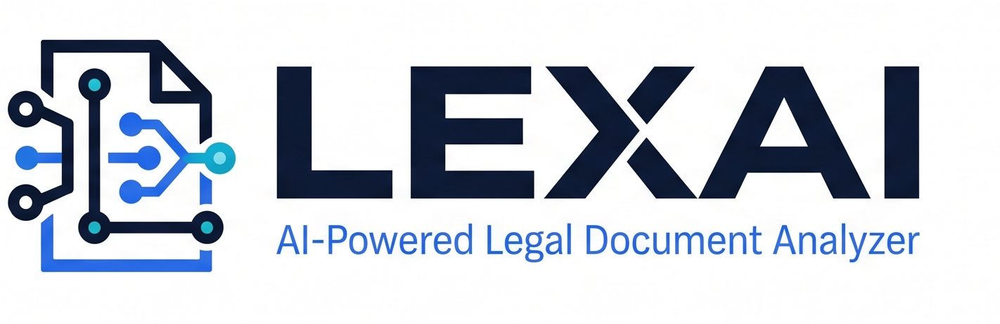
</p>

<p align="center">

AI-powered legal document intelligence platform built with **Next.js**, **FastAPI**, **Azure AI Foundry**, **Semantic Kernel**, and **Azure AI Services**.

Upload legal documents and receive AI-generated summaries, risk analysis, financial insights, multilingual translations, and document-grounded legal conversations—all from a single workspace.

</p>

---

# ✨ Features

- 📄 AI Contract Summarization
- ⚠️ Legal Risk Detection
- 💰 Financial Term Extraction
- 🤖 AI Legal Chat (RAG Powered)
- 🌍 Multi-language Translation
- 📊 Interactive Risk Analytics
- 📁 Document Workspace
- ⚡ Enterprise Ready Architecture
- 🔍 Context-aware Question Answering
- ☁️ Azure AI Foundry Integration

---

# 🏗 Tech Stack

## Frontend

- Next.js 15
- React
- TypeScript
- Tailwind CSS
- Framer Motion
- Recharts
- Lucide Icons

## Backend

- FastAPI
- Python
- Semantic Kernel
- Azure AI Foundry
- Azure OpenAI
- Azure AI Translator
- Azure Document Intelligence
- Azure Blob Storage

## AI

- GPT Models (Azure AI Foundry)
- Semantic Kernel
- RAG
- Prompt Engineering
- Document Intelligence
- AI Translation
- Risk Classification

---

# 🚀 Complete User Flow

---

## 1. Dashboard

Users can view every uploaded legal document along with its processing status.

- Upload new contracts
- Track processing
- Open completed analysis
- Manage documents

<p align="center">
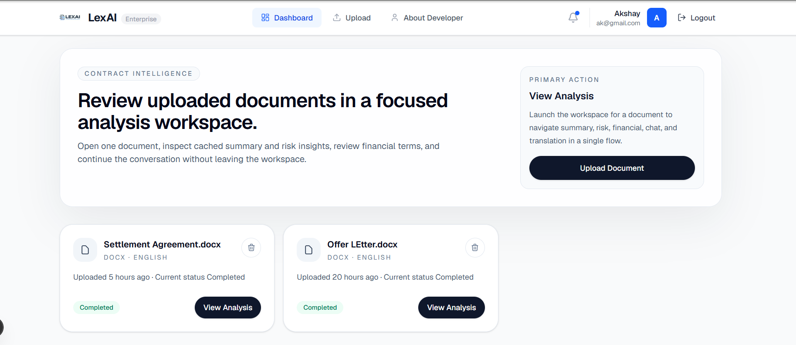
</p>

---

## 2. Upload Document

Upload PDF or DOCX contracts.

During upload LexAI continuously processes the document while displaying AI capabilities.

### Supported

- PDF
- DOCX

### AI Pipeline

- Extract Text
- Analyze Clauses
- Generate Summary
- Detect Risks
- Extract Financial Terms
- Enable AI Chat
- Translate Content

<p align="center">
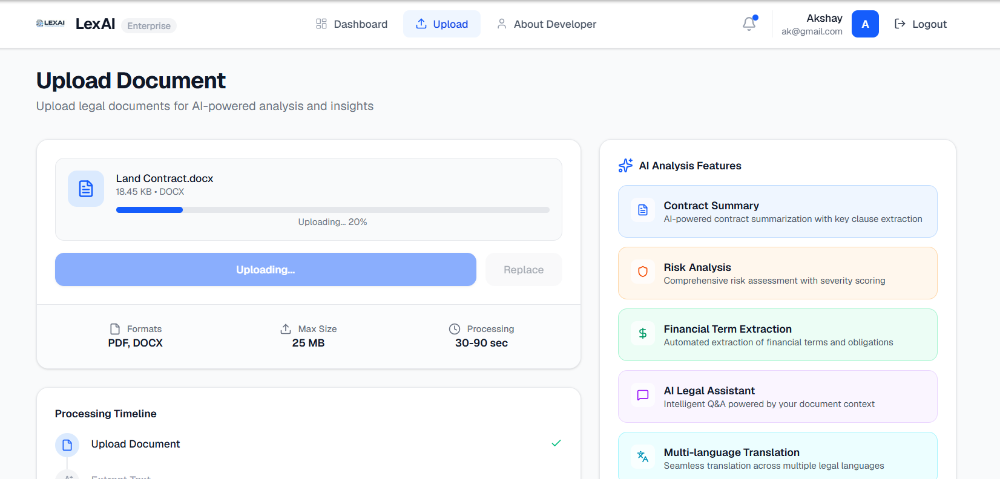
</p>

---

## 3. Processing Status

Once uploaded, every document moves through an intelligent processing pipeline.

Users can immediately monitor:

- Upload Status
- Processing Progress
- Analysis Completion

<p align="center">
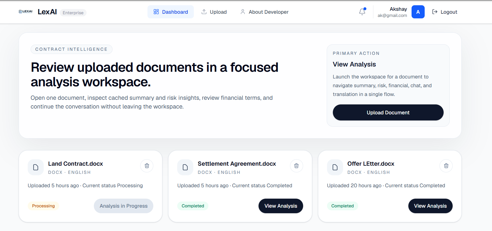
</p>

---

# 📑 Document Analysis Workspace

After processing completes, LexAI opens a dedicated analysis workspace.

Every document includes multiple AI powered views without leaving the same screen.

---

## Executive Summary

LexAI automatically generates:

- Executive Summary
- Rights
- Obligations
- Important Dates
- Detailed Summary
- Clause Breakdown

<p align="center">
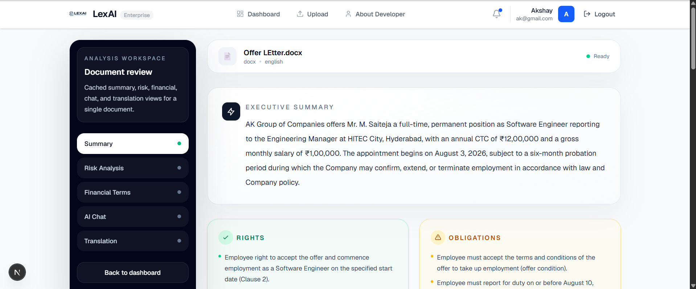
</p>

---

## Important Dates Timeline

Automatically extracts contractual dates such as:

- Joining Date
- Probation Period
- Offer Date
- Deadlines
- Expiry Dates

<p align="center">
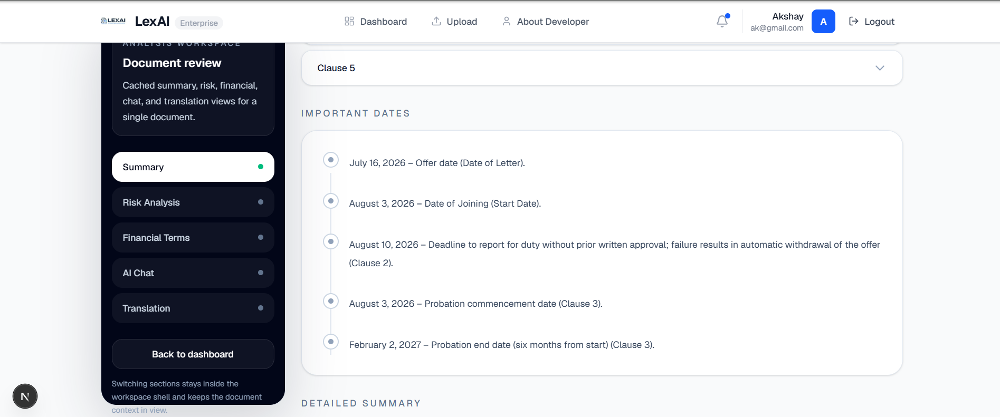
</p>

---

# ⚠️ Risk Analysis

LexAI evaluates legal contracts across multiple categories.

The platform calculates:

- Overall Risk Score
- Risk Level
- Risk Categories
- Severity
- Compliance Issues

<p align="center">
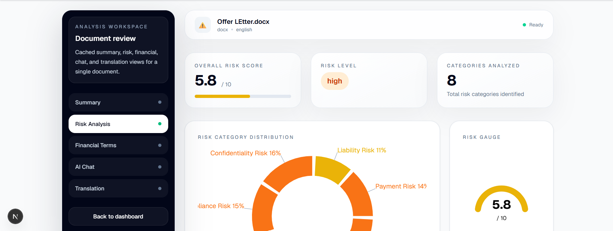
</p>

---

## Risk Visualizations

Interactive analytics include:

- Risk Distribution
- Category Comparison
- Severity Distribution
- Top Risks

<p align="center">
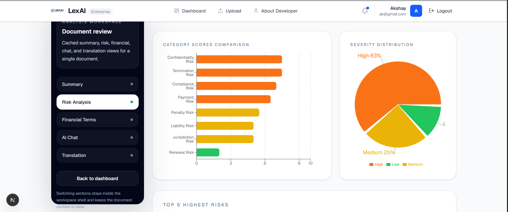
</p>

---

# 💰 Financial Term Extraction

Automatically extracts:

- Salary
- Compensation
- Payment Frequency
- Currency
- CTC
- Incentives
- Joining Date
- Financial Obligations

<p align="center">
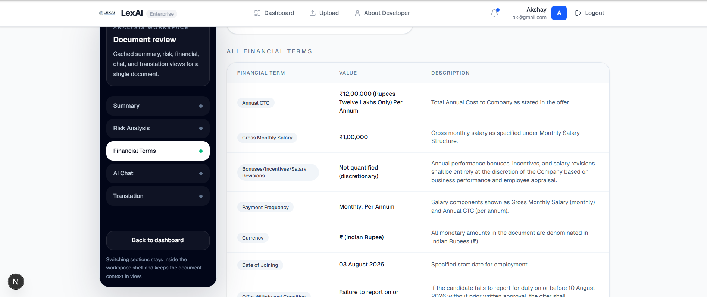
</p>

---

# 🤖 AI Legal Assistant

Users can ask natural language questions directly about the uploaded contract.

Examples:

- Who are the parties?
- What are my obligations?
- What happens if I terminate?
- Are there penalties?
- What are the payment terms?

Responses are generated using document-grounded context.

<p align="center">
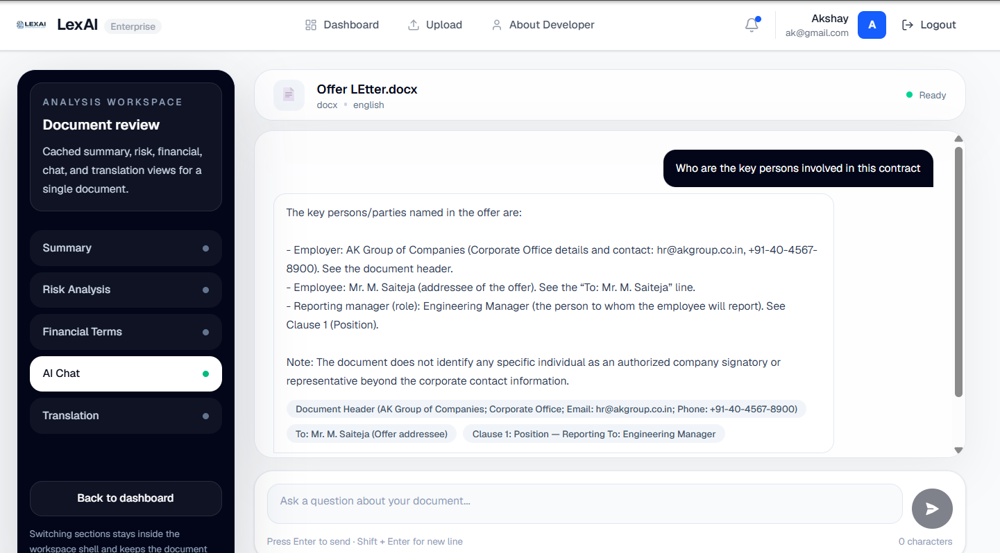
</p>

---

# 🌍 Translation

LexAI can translate legal documents into multiple languages while preserving legal meaning.

Current capabilities include:

- Telugu
- Hindi
- Tamil
- Kannada
- English
- More Azure Translator supported languages

<p align="center">
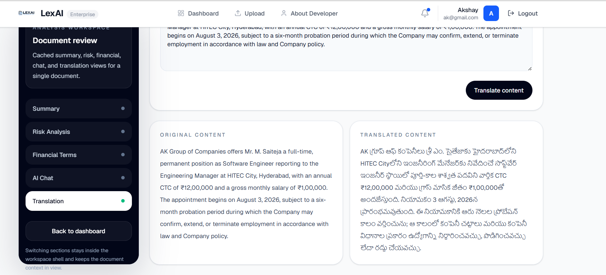
</p>

---

# 📂 Project Structure

```text
LexAI
│
├── backend
│
├── frontend
│
├── images
│   ├── 1.png
│   ├── 2.png
│   ├── ...
│   └── 10.png
│
├── README.md
└── ...
```

---

# 🧠 AI Workflow

```text
Upload Document
        │
        ▼
Document Intelligence
        │
        ▼
Text Extraction
        │
        ▼
Semantic Processing
        │
        ▼
Azure AI Foundry
        │
 ┌──────┼─────────────┐
 ▼      ▼             ▼
Summary Risk      Financial Terms
 │
 ▼
AI Chat
 │
 ▼
Translation
```

---

# 🎯 Key Capabilities

✅ AI Powered Contract Summarization

✅ Legal Risk Assessment

✅ Financial Intelligence

✅ AI Legal Chat

✅ Context Aware Responses

✅ Clause Extraction

✅ Timeline Generation

✅ Translation

✅ Enterprise Ready

---

# ⚙️ Installation

```bash
git clone https://github.com/yourusername/LexAI.git
```

```bash
cd frontend
npm install
npm run dev
```

Backend

```bash
cd backend
pip install -r requirements.txt
uvicorn app.main:app --reload
```

---

# 🔐 Environment Variables

```env
AZURE_OPENAI_ENDPOINT=

AZURE_OPENAI_API_KEY=

AZURE_OPENAI_DEPLOYMENT=

AZURE_DOCUMENT_INTELLIGENCE_ENDPOINT=

AZURE_DOCUMENT_INTELLIGENCE_KEY=

AZURE_TRANSLATOR_ENDPOINT=

AZURE_TRANSLATOR_KEY=
```

---

# Future Roadmap

- OCR Improvements
- Clause Comparison
- Contract Version Diff
- AI Negotiation Suggestions
- Clause Library
- Compliance Engine
- Multi-document Analysis
- Team Collaboration
- Approval Workflow
- Export Reports

---

# Author

**Akshay Kireet**

AI Engineer | Microsoft Technology Consultant

Built with ❤️ using Azure AI Foundry and Semantic Kernel.